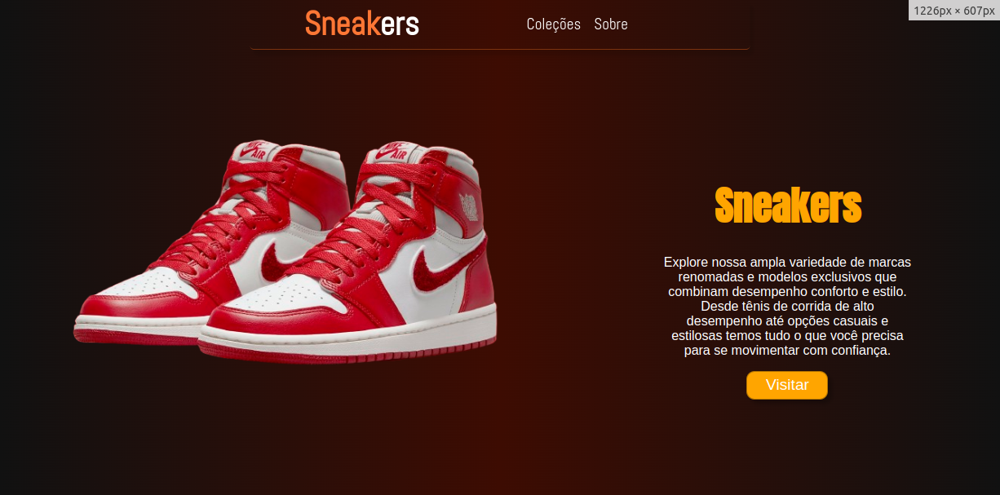
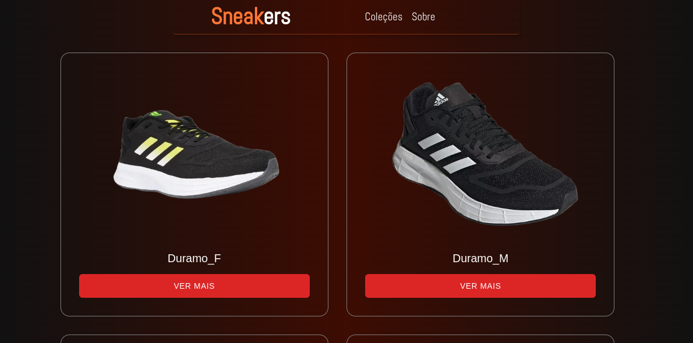
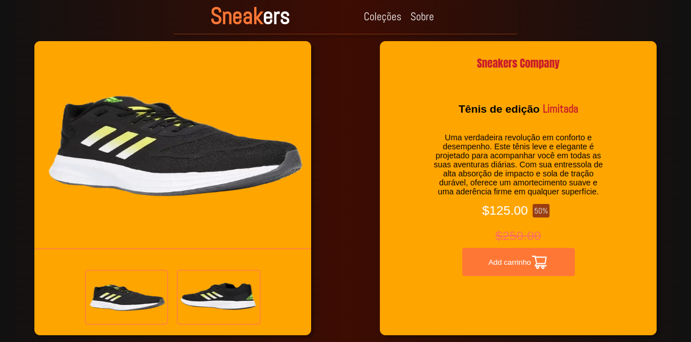

# 🚀 Sneakers


---

[](https://sneakers-opal-alpha.vercel.app)

A complete e-commerce solution rebuilt with modern development practices, showcasing my evolution as a developer.

## 🌟 What's New?

This refactored version includes:

- Modern React patterns and architecture
- Enhanced performance optimization
- Improved responsive design
- Better state management
- Accessibility improvements
- Code quality enhancements

## 🔑 Key Features

- Product catalog with dynamic filtering
- Product detail pages with gallery
- Responsive mobile-first design
- Interactive shopping experience
- Contact and about sections
- Modern UI/UX best practices

## 🛠 Technologies Used


**Services Integration:**

- Vercel Hosting
- GitHub Actions (CI/CD)
- Responsive Design Tools

## 🚀 Getting Started

### Prerequisites

- Node.js ≥16.x
- npm/yarn

### Installation

```bash
git clone https://github.com/EmersonSinezio/Sneakers.git
cd Sneakers
npm install
npm run dev
```

<br>

# 🖥️ Application Flow

## <details> <summary>🠠Home Page</summary>  </details> <details> <summary>👟 Product Collection</summary>  </details> <details> <summary>📦 Product Details</summary>  </details>

<br>

## 🌍 Live Deployment

[](https://sneakers-opal-alpha.vercel.app)

## 🤝 Contributing

Contributions are welcome! Please follow our [contribution guidelines](CONTRIBUTING.md).

## 📄 License

This project is licensed under the MIT License - see [LICENSE.md](LICENSE.md) for details.

## 👨💻 Author

**Emerson Mesquita Sinézio**  
[](mailto:emerson.sineziio@gmail.com)
[](https://www.linkedin.com/in/your-profile)
